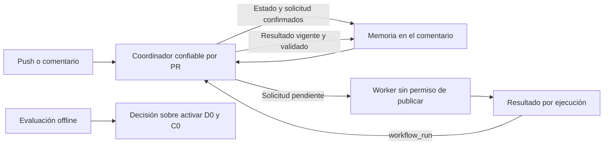

# Arquitectura para corregir y completar el revisor de PRs

Estado: diseño para revisión, sin implementación. Fecha: 2026-10-05.

Base: [`179e6a3719b8ff611c820e1575f15d40e36e1ddb`](https://github.com/gon0801/goncloud-pr-review/commit/179e6a3719b8ff611c820e1575f15d40e36e1ddb). El checkout local está 35 commits atrás y contiene documentos pendientes. Las rutas y capacidades descritas corresponden a esa base remota; este documento complementa el diseño anterior y no cambia sus estados de entrega.

La propuesta corrige la preparación del contexto, conecta la identidad de hallazgos ya construida y concentra las escrituras en un coordinador por PR. El comentario conserva toda la memoria necesaria. Los workers producen resultados aislados y no publican. La evaluación se separa por producto y configuración antes de activar el diff incremental nuevo.

El encargo termina en este diseño. Las firmas y ejemplos son bocetos dentro de Markdown. No autorizan modificar código, instalar workflows, migrar estados, hacer mediciones pagadas o desplegar.

## Alcance y decisiones existentes

| Frente | Estado en la base | Resultado propuesto |
|---|---|---|
| Contexto y presupuestos | Tres errores reproducidos en selección de tests, rutas y unidades del diff. | Rutas exactas, búsquedas con resultado explícito y bytes del archivo realmente escrito. |
| Identidad F0 | Dominio implementado; el pipeline todavía usa la fusión por ruta y título. | Una única aceptación de reportes que use la política de identidad solicitada. |
| Memoria M0/M1 | Lector compatible y conservación ante desborde ya entregados. | Completar escritura compatible y persistir coordinación sin perder lo anterior. |
| Publicación y comandos | El PATCH no comprueba vigencia; descartar requiere otra ejecución. | Escritor único, solicitudes persistidas y comandos sin push. |
| Evaluación | Comparador y muestra parcial existentes. | Métricas por variante y pares comparables, con ausencias visibles. |
| Incremental D0 | Filtra archivos del segundo push, pero entrega su diff desde la base del PR. | Separar cambios nuevos de contexto y medir el efecto antes de activarlo. |

Se conservan DeepSeek V4.1 Flash, el fallback existente, el comentario único, las exclusiones de forks y drafts, las instrucciones desde la base confiable y el acceso del modelo limitado a Read/Grep/Glob. Las fallas del proveedor siguen como aviso informativo sin confirmar revisión completa. Q0, P0 y M1 no se implementan otra vez. [Estado de los bloques](https://github.com/gon0801/goncloud-pr-review/blob/179e6a3719b8ff611c820e1575f15d40e36e1ddb/Plans.md#L75).

## Alternativas y decisión de síntesis

Se compararon dos formas completas mediante `pstack:architect` y `pstack:arena`.

| Criterio, de 1 a 5 | A: estado en el comentario | B: registro durable en Git |
|---|---:|---:|
| Corrección y aceptación | 4 | 5 |
| Estado y concurrencia | 4 | 5 |
| Profundidad de interfaces | 5 | 4 |
| Compatibilidad y operación | 4 | 3 |
| Medición y entrega | 5 | 5 |
| Total del evaluador independiente | 22 | 22 |

Se elige A por reutilizar el dominio y evitar permisos de escritura de contenido, ramas de estado y un segundo almacenamiento. Del candidato B se incorporan solicitudes persistidas antes del trabajo, claves explícitas de idempotencia y la matriz de recuperación ante caídas. Las correcciones del evaluador están incorporadas en los contratos siguientes. Las puntuaciones valoran diseños; no son mediciones del revisor.

B guardaría eventos y resultados en una rama por PR, actualizaría esa rama comparando el commit esperado y trataría el comentario como una vista reconstruible. Oculta mejor la recuperación histórica y permite más capacidad, pero añade `contents: write`, retención, reglas de ramas y dos representaciones que mantener. Se reconsidera si el comentario deja de alcanzar o recuperar comentarios eliminados se vuelve requisito. Un servicio con base de datos añade todavía más operación. Los artifacts con vencimiento sirven únicamente para transportar resultados.

## Uso antes de los tipos

El usuario sigue usando los comandos existentes y recibe dos nuevos:

```text
ai-review: descartar F3
ai-review: descartar todo
ai-review: explicar F3
ai-review: revisar
```

Todos requieren permiso de escritura, mantenimiento o administración. Una explicación identifica el SHA y no cambia el estado del hallazgo. Descartar se confirma cuando el efecto quedó guardado. Revisar admite una solicitud aunque HEAD no haya cambiado; despacharla no equivale a terminarla.

Tres callers ilustran la arquitectura futura:

```python
# Coordinador confiable: admite un push, comando o resultado autenticado.
decision = reconcile(snapshot, event, live_facts, policy)
# Commit contiene estado Y trabajo que sólo puede arrancar después de guardarlo.
receipt = publish_checkpoint(decision, observed_comment)
dispatch_confirmed(receipt.work)  # una escritura incierta no entrega trabajo

# Worker: lee una solicitud persistida y verifica que siga pendiente.
prepared = prepare_review(repository, request, snapshot, policy)
outcome = run_model(prepared)  # sin token para modificar el comentario
upload_result(request.id, prepared, outcome)  # datos aislados por run/attempt

# Evaluación offline: pares definidos antes de mirar sus resultados.
report = compare_reviews(corpus, observations, judgments, pairing)
```

El transporte, las llamadas GitHub y la serialización no forman parte de los tipos que consume el dominio. `dispatch_confirmed` también atiende pendientes recuperados en una ejecución posterior. Una confirmación perdida puede causar otro intento del modelo; no puede repetir el efecto de un comando.



## Módulos y límites

| Dueño | Responsabilidad | Interfaz que oculta la complejidad |
|---|---|---|
| `review_domain.py`, existente | Identidad, transiciones, solicitudes, cobertura y codec. Puro, sin Git, red o modelo. | `reconcile`, `read_snapshot`, `encode_snapshot`; reutiliza matching y aceptación existentes. |
| `review.py`, existente | CLI, autenticación GitHub, coordinación, ejecución del modelo y presentación. | Comandos actuales para compatibilidad; futuros `reconcile` y `execute-request` para la instalación nueva. |
| `review_context.py`, futuro en D0 | Lectura Git, delta, obligaciones, contexto y presupuesto. | `prepare_review` devuelve paquete y hechos coherentes. R0 corrige primero las funciones actuales sin exigir esta extracción. |
| Workflows y `action.yml` | Separación de credenciales, activación y exclusión de escritores. | Workers y coordinador con roles diferentes. |
| `scripts/compare_reviews.py`, existente | Cohortes, adjudicación y métricas. | Informe offline con grupos y pares explícitos. |

No se crean módulos separados para cargar, validar y guardar el mismo esquema. El dominio concentra esas reglas. El recorrido de una transición requiere leer el adaptador y el dominio. La extracción del contexto ocurre al introducir el comportamiento D0, con migración de callers en ese mismo bloque.

## Tipos y firmas propuestas

Se reutilizan `Finding`, `AnchorLegacy`, `AnchorLocated`, `Observation`, `RepositoryFacts`, `ReviewPlan`, `ReviewPolicy`, `ValidatedReport` y las transiciones de F0. Se endurecen sus fronteras; no se construye otro modelo paralelo de hallazgos.

```python
# Boceto declarativo. Los cuerpos no están implementados.
@dataclass(frozen=True)
class ReviewTarget:
    repository_id: int
    pr_number: int
    head_sha: str
    base_sha: str          # punta real de la rama base
    merge_base_sha: str    # origen del diff completo
    policy_digest: str

@dataclass(frozen=True)
class GitPath:
    raw: bytes            # identidad para Git, nunca texto escapado de Markdown

SearchResult = Complete(paths) | Truncated(paths, reason) | Failed(reason)
Coverage = CompleteClaim(obligations) | Partial(missing, reason) | Unknown(reason)
RequestKind = Review(target) | Explain(finding_id, target, finding_digest)
RequestState = Pending() | Running(run_key) | Finished(receipt) | FailedRetryable(reason)

@dataclass(frozen=True)
class WorkRequest:
    id: int               # contador monotónico por PR; nunca se reutiliza
    origin: Origin        # evento de PR, comentario o re-run autenticado
    kind: RequestKind
    basis_generation: int
    state: RequestState

@dataclass(frozen=True)
class RunKey:
    request_id: int
    run_id: int
    attempt: int

DomainEvent = RequestReview(origin) | AuthorizedCommand(command) | ReportReady(report)
Decision = Commit(snapshot, work_after_commit) | Keep(reason)

def reconcile(current: Snapshot, event: DomainEvent,
              facts: RepositoryFacts, policy: ReviewPolicy) -> Decision:
    raise NotImplementedError

def prepare_review(repo: GitRepository, request: WorkRequest,
                   current: Snapshot, policy: ReviewPolicy) -> PreparedReview:
    raise NotImplementedError

def encode_snapshot(current: Snapshot,
                    budget: StorageBudget) -> EncodedCheckpoint | CapacityExceeded:
    raise NotImplementedError
```

`Complete`, `Commit` y los demás constructores de una línea representan uniones discriminadas. `Origin` identifica el evento y su contenido autenticado; `AuthorizedCommand` sólo se construye después de consultar permisos. `ReportReady` recibe un reporte validado de nuevo por el coordinador. Un worker no puede declarar que sus propios datos son confiables.

`PreparedReview` reúne plan, hechos Git, bytes exactos del diff/contexto y omisiones con causa. `RepositoryFacts` separa `changed_paths`, `reverted_paths`, renombres y blobs verificados de los archivos entregados al modelo. `ReviewPlan` guarda target, generación de origen, obligaciones requeridas y entregadas. `ValidatedReport` conserva cobertura declarada, obligaciones declaradas cubiertas y evidencias rechazadas.

La revisión y los metadatos de coordinación amplían el esquema persistente. Se propone **schema 3**, reutilizando los tipos de v2: revisión con base y merge-base separados, cobertura, contador de solicitudes, solicitudes pendientes, recibos necesarios para idempotencia y cursor de comandos. No se agregan campos a v2 que un escritor viejo pueda eliminar sin advertirlo. Lectores anteriores deben tratar schema 3 como futuro y conservarlo.

Las solicitudes terminadas pueden compactarse después de persistir su resultado y recibo. Nunca se compactan pendientes ni se reutilizan IDs. Un resultado sólo puede satisfacer una solicitud existente pendiente; un ID ausente no crea otra solicitud. El cursor evita reaplicar comentarios consumidos. No hace falta conservar un historial ilimitado de todos los runs para impedir efectos repetidos.

## Política única desde el workflow hasta la publicación

La configuración confiable se normaliza una vez en `ReviewPolicy`. Incluye versión del revisor y prompt, `finding_identity`, modos de diff/contexto, exclusiones, reglas y sus digests, presupuestos y estrategia de almacenamiento. El digest se calcula sobre esa representación canónica, no sobre texto libre del modelo.

La solicitud conserva el target y digest. `prepare`, `run` y publicación reciben la misma política normalizada. Cada etapa valida su identidad. El coordinador reconstruye la política desde configuración confiable antes de aceptar el resultado. El paquete del worker no puede cambiarla. `current` selecciona la coincidencia compatible; `anchors` selecciona F0 dentro del mismo aceptador.

Esto reemplaza el recorrido actual en el que `finding_identity` sólo llega a `run`, allí se valida y luego se descarta. La rama nueva de publicación debe invocar la aceptación del dominio y actualizar estados conocidos; no puede seguir devolviendo `Keep` para todo v2 ni terminar en `merge_findings` legado. [Interfaz actual](https://github.com/gon0801/goncloud-pr-review/blob/179e6a3719b8ff611c820e1575f15d40e36e1ddb/action.yml#L35).

## R0 para rutas, búsqueda y bytes

Git entrega rutas mediante registros NUL, leídos como bytes. Todas las consultas usan la identidad original y argumentos separados con `--`. La presentación escapa caracteres especiales sin reutilizar luego esa representación como ruta. Unicode, tabs y saltos de línea válidos en UTF-8 se conservan. Una ruta o blob que no pueda representarse en el canal del modelo se identifica como no revisado por encoding, con su identidad binaria disponible para diagnóstico; no se decodifica con reemplazos silenciosos.

La búsqueda filtra cuáles coincidencias son tests antes de aplicar el límite de resultados. Se consume en flujo, con techos iniciales propuestos de 8 MB de salida examinada y 15 segundos por búsqueda. Alcanzar un techo produce `Truncated`, incluso con cero resultados. Un error Git produce `Failed`. Sólo `Complete` vacío permite afirmar que la búsqueda no encontró pruebas. Estas cifras son límites iniciales de ingeniería, no rendimiento medido.

El presupuesto del diff corresponde a `len(diff_bytes)` y el manifiesto declara esa misma longitud. Los límites de contexto cuentan su serialización UTF-8 final, incluidos encabezados y avisos. Se reserva espacio para el aviso antes de recortar y se respeta el límite entre caracteres.

La excepción actual que admite el primer archivo grande se conserva en el modo compatible y se declara con `over_budget_bytes`. El arreglo de unidades no cambia esa política implícitamente. El experimento D0 usará un presupuesto estricto: un archivo que no cabe queda como obligación pendiente y la revisión será parcial. No se trocean hunks de forma invisible.

La omisión de una pista opcional de callers/tests degrada el contexto y queda visible; no demuestra por sí sola que el código no se revisó, porque el modelo aún puede explorar. La omisión de una obligación de revisión, una enumeración incompleta del diff o un blob obligatorio ilegible sí impide cobertura completa.

## Identidad, evidencia y cobertura

Antes de aceptar F0, el parser rechaza formas inválidas como rangos `[3]`, `[3, "x"]`, booleanos usados como líneas o referencias sin estructura válida. Devuelve un error tipado y conserva el estado; no deja escapar `IndexError` o `ValueError`. Un bloque inválido no confirma cobertura. La prosa de diagnóstico puede mostrarse con esa limitación.

Los hechos incluyen blobs del commit actual y los anteriores necesarios para verificar anclas persistidas. El adaptador obtiene el delta real entre revisiones, aunque la revisión deba ser completa. No deriva `changed_paths` de `reviewed`. Renombres y reversiones se comprueban con Git; evidencia insuficiente no autoriza resolver un hallazgo.

Título y causa son información mutable. Las anclas compatibles conservan IDs; la ambigüedad conserva problemas separados. Se mantienen descartes, resolución por reversión exacta y arreglos en archivos relacionados. La ausencia de un hallazgo en la respuesta no lo resuelve. Una cita verificada acredita ubicación, no la veracidad del diagnóstico.

La cobertura persistida se deriva en un solo lugar. `CompleteClaim` requiere un resultado válido y vigente, runtime terminado, obligaciones entregadas y declaradas cubiertas, y ausencia de omisiones obligatorias. Un corte de turnos, diff incompleto o reporte inválido degrada esa cobertura. El estado y el marcador visible se generan desde el mismo valor. Sigue siendo una declaración de revisión del alcance, no una prueba de exhaustividad.

## Capacidad y compatibilidad del estado

El límite actual es **8000 bytes UTF-8**. La evidencia de M1 midió 5897 bytes para diez hallazgos enriquecidos y 33947 para sesenta. Conectar F0 y comandos sin diseñar capacidad puede dejar el revisor conservando el estado anterior en cada intento. [Evidencia M1](https://github.com/gon0801/goncloud-pr-review/blob/179e6a3719b8ff611c820e1575f15d40e36e1ddb/docs/evidence/reviewer/M1.md).

Se propone un perfil ampliado de 40000 bytes de estado y un máximo conservador de 60000 bytes y 60000 caracteres para el comentario completo. Son presupuestos propuestos del proyecto, no una afirmación sobre el límite documentado de la API. El cuerpo visible recibe el espacio restante después de reservar memoria y metadatos. Las respuestas a comandos tienen retención visible acotada; las decisiones y solicitudes aún pendientes permanecen en el checkpoint.

El perfil ampliado se activa sólo después de verificar comentario real, roundtrip y capacidad de casos representativos con hallazgos, evidencia y solicitudes simultáneas. Sesenta hallazgos no constituyen una garantía de cabida para cualquier longitud de rutas o evidencia. Mientras tanto, el piloto de 8000 bytes admite sólo snapshots que quepan con reserva medida para coordinación. Si la prueba representativa no cabe en el perfil ampliado, se revisa capacidad o se reconsidera B; no se declara completada la activación general.

Nunca se recortan rutas, IDs, descartes, anclas necesarias, cursores o solicitudes aceptadas. Se puede reducir prosa no esencial antes de serializar. Ante `CapacityExceeded`, se conserva el checkpoint previo y no se confirma el nuevo SHA, resultado o comando. El comentario informa el desborde. Los artifacts no guardan una parte imprescindible del estado.

El codec debe conservar igualdad semántica al escribir y leer. Para impedir cierres de HTML se usan escapes JSON reversibles, como `\u003e`; no se sustituye `-->` por otro carácter dentro de una ruta. La aceptación incluye Unicode, tabs, saltos de línea y delimitadores HTML en campos de identidad.

La migración distingue memoria ausente, legacy válido, v2 válido, versión futura y corrupción. Sólo ausencia real permite un estado inicial vacío. Se preservan IDs, `next`, descartes y `seen`; la cobertura antigua que no pueda acreditarse queda desconocida. Schema 3 se escribe únicamente después de distribuir su lector y un escritor compatible operativo.

## U0 con un coordinador y solicitudes persistidas

El coordinador admite solicitudes, aplica comandos, acepta resultados y publica el comentario. Todo ese trabajo comparte un grupo por repositorio y PR con `cancel-in-progress: false`; ningún workflow padre puede cancelar al escritor activo. El modelo corre fuera de ese grupo. La exclusión protege sólo a escritores que participan del protocolo, por lo que el despliegue debe retirar previamente a todos los escritores antiguos.

Para persistir la solicitud antes del modelo, el diseño propone un workflow confiable `ai-review-publish.yml` con cuatro entradas:

| Evento | Trabajo breve del coordinador |
|---|---|
| `pull_request_target` permitido | Admite una solicitud para el head/base/política actuales. Nunca ejecuta ni instala código del PR. |
| `issue_comment.created` | Relee y autoriza comandos del PR; persiste sus efectos o solicitudes. |
| `workflow_run.completed` del worker permitido | Autentica el origen, valida el paquete y acepta un resultado vigente. |
| `workflow_dispatch` de recuperación | Redescubre solicitudes y resultados pendientes para el PR indicado. |

La entrada `pull_request_target` sólo registra trabajo desde código confiable. Mantiene los filtros de repo, PR abierto, draft, fork y desactivación. El worker se inicia por `workflow_dispatch`, lee la solicitud persistida y obtiene el commit del PR como datos. No se entrega un evento de comentarios al `Check inputs` actual que únicamente admite `pull_request`. El worker nuevo utiliza el CLI confiable `execute-request`.

Los comandos llegan en orden por ID. Se procesa un prefijo confirmado: si la consulta de permisos falla, ese comentario y los posteriores quedan sin consumir. Una denegación confirmada o un ID de hallazgo inexistente producen un rechazo visible y pueden avanzar el cursor junto con el recibo. Una edición posterior de un comentario ya procesado no altera la decisión. Si un comentario se editó antes de su primera admisión, se rechaza como ambiguo y se pide un comentario nuevo; no se reconstruye un cuerpo original que la API ya no ofrece.

`descartar todo` captura únicamente IDs abiertos antes de incorporar reportes pendientes del modelo. Explicar fija el hallazgo, target y digest que debe explicar. Revisar agrupa solicitudes automáticas compatibles para el mismo target; un comando o re-run explícito tiene origen único y puede crear otra revisión del mismo SHA. Los IDs de solicitud monotónicos evitan reutilizar identidades al compactar resultados terminados.

`Commit(snapshot, work_after_commit)` obliga a guardar solicitud y cursor antes de despachar. Después se relee la generación y se verifica el recibo. Si la respuesta de PATCH es incierta, no se presume fracaso ni se repite a ciegas. El siguiente ciclo consulta el checkpoint y los runs asociados antes de volver a despachar. Pueden existir dos intentos pagados en una caída; sólo uno satisface la solicitud pendiente.

Un resultado contiene request ID, run/attempt, plan y digests. El coordinador vuelve a obtener permisos, head, base, política y hechos pertinentes. Si la generación cambió sólo por descartes compatibles, acepta sobre el snapshot actual y preserva esos descartes. Si cambió la revisión, la política o las obligaciones necesarias, el resultado no acredita cobertura y queda pendiente trabajo vigente. No se modifica artificialmente la generación del plan para hacerlo encajar.

La clave `(request_id, run_id, attempt)` y la solicitud pendiente determinan idempotencia. Un resultado repetido, otro intento después de finalizar la solicitud o un resultado de solicitud desconocida no vuelve a asignar IDs. Los fallos antiguos tampoco reemplazan una revisión más reciente con un aviso obsoleto.

GitHub no documenta CAS en el PATCH de comentarios. Se usa exclusión del escritor y relectura; no se simula una transacción con HEAD. Un push entre comprobación y escritura puede dejar temporalmente visible el resultado del SHA anterior, siempre identificado. La consulta posterior detecta el desfase y admite trabajo nuevo. [API de comentarios](https://docs.github.com/en/rest/issues/comments#update-an-issue-comment).

La concurrencia de Actions tiene por defecto un pendiente reemplazable; la documentación actual también ofrece `queue: max`, limitada a 100 pendientes. Ninguna modalidad sustituye la recuperación desde estado persistido. El diseño funciona con la modalidad simple y no depende del orden de despacho. [Concurrencia de Actions](https://docs.github.com/en/actions/how-tos/write-workflows/choose-when-workflows-run/control-workflow-concurrency).

## Recuperación y fronteras de confianza

| Punto de caída | Recuperación y efecto permitido |
|---|---|
| Antes de admitir un comando | Se relee su comentario; no se había confirmado su efecto. |
| Estado confirmado, antes de dispatch | La solicitud pendiente permite otro despacho. |
| Worker duplicado o respuesta de dispatch perdida | Se descubren runs asociados; resultados compiten por una solicitud pendiente y sólo uno se acepta. |
| Artifact perdido o vencido | Se mantiene la solicitud; otra ejecución puede repetir el modelo. |
| Resultado disponible, antes de PATCH | Se valida otra vez contra estado y revisión actuales. |
| PATCH confirmado pero respuesta perdida | El recibo y la solicitud finalizada impiden duplicar efectos. |
| POST inicial incierto | Se consulta el marcador antes de intentar crear otro comentario; no se hace un POST ciego. |
| Evento pendiente reemplazado | El próximo despertar relee pendientes y resultados, sin suponer que ese evento sobreviva. |
| No llega ningún nuevo evento | La solicitud queda visible; la recuperación manual o el siguiente evento reanuda. No se promete un cron inexistente. |

Si se detectan varios stickies previos, el coordinador detiene la escritura para reconciliar su memoria; no elimina uno automáticamente ni fusiona estados incompatibles. Eliminar el único comentario puede destruir memoria. Esta propuesta no promete recuperarla desde artifacts vencidos.

Los artifacts son JSON y datos acotados, aislados por request/run/attempt. Se propone retención de siete días, independiente de la durabilidad del checkpoint. El coordinador verifica por API repositorio, workflow, ref confiable, run y attempt; vincula el request ID a una solicitud persistida y comprueba target, política y digests. Para workers iniciados por `workflow_dispatch`, el SHA del workflow corresponde al código confiable y no tiene por qué ser el HEAD del PR: ambos se validan por separado. Nunca se ejecuta contenido del artifact. [Eventos y privilegios](https://docs.github.com/en/actions/reference/workflows-and-actions/events-that-trigger-workflows#workflow_run).

El coordinador usa `contents: read`, `pull-requests: write` y los permisos Actions necesarios para leer runs y despachar. No necesita claves del proveedor. El worker recibe las claves de proveedor, conserva el aislamiento actual del modelo y carece de permiso para escribir comentarios. Código de la action y coordinador se fija a una revisión confiable; contenido del PR sólo se lee como datos. `workflow_dispatch` permite iniciar trabajo con `GITHUB_TOKEN`; no se depende de que un comentario del bot dispare otro workflow. [Comportamiento del token](https://docs.github.com/en/actions/concepts/security/github_token).

Las solicitudes pendientes se vuelven a autorizar antes de iniciar trabajo costoso. Un permiso revocado produce rechazo terminal visible sin llamar al modelo. Los resultados de una explicación que ya no coincide con su hallazgo o target quedan identificados como antiguos y no se presentan como explicación de la revisión actual.

## Evaluación comparable

La evidencia existente contiene 20 de los 30 PRs previstos, seis de diez pares de pushes y cinco casos comparables con CodeRabbit en el SHA exacto. Las 62 adjudicaciones mezclan productos. La precisión agregada 39/62 no mide a cada revisor. [Evidencia existente](https://github.com/gon0801/goncloud-pr-review/blob/179e6a3719b8ff611c820e1575f15d40e36e1ddb/docs/evidence/reviewer/E1.md).

El comparador conserva la evidencia histórica y agrega una versión de informe con tres salidas: métricas por producto/configuración, comparación de la cohorte pareada y catálogo de observaciones sin pareja con su causa.

```python
CaseKey = (case_id, repository_id, base_sha, head_sha, task_kind, previous_sha)
ObservationKey = (CaseKey, product, configuration_digest, repetition, attempt)
FindingKey = (ObservationKey, finding_id)
PairKey = (CaseKey, experiment_id, repetition)
```

Los pares se fijan antes de evaluar resultados. Comparten tarea y SHAs; la configuración experimental puede cambiar en la dimensión declarada. Se validan también repositorio y commit anterior en experimentos incrementales. Los juicios usan la clave completa del hallazgo: no obligan a fabricar IDs distintos entre productos para evitar colisiones. La migración de la adjudicación vieja sólo se admite cuando su asociación es inequívoca.

Cada grupo informa válidos, falsos positivos, duplicados, no adjudicados y exclusiones. Precisión usa denominador explícito. La recuperación de defectos sólo se calcula con un conjunto de referencia declarado. Una revisión fallida permanece en la tasa de fallos y el costo total; no desaparece al comparar velocidad. Se muestran duración por solicitud incluyendo reintentos, distribución de intentos exitosos y fallidos, número de pares y costos desconocidos como desconocidos.

La hoja para juzgar elimina nombres de producto, badges y severidad con formato propio de cada herramienta. Conserva diagnóstico, ubicación y evidencia en una representación común. La severidad original se conserva aparte para análisis posterior. Se versionan normalización, jueces y desempates; la adjudicación por IA sigue permitida y se identifica como tal. No se sustituye el consenso histórico al corregir el cegamiento.

Los PRs completos se asignan a ajuste o evaluación reservada. Todos los pushes de un PR quedan juntos. La muestra y criterios pendientes de E1 se completan o se revisan expresamente antes de activar D0/C0. Corregir R0, identidad y publicación no depende de juntar treinta PRs.

## D0 y contexto selectivo

El trabajo nuevo procede de `previous_head..head`. El contexto histórico y las obligaciones de hallazgos abiertos se entregan aparte, con su procedencia. El delta incluye eliminaciones y reversiones aunque el archivo haya desaparecido del diff global del PR. Los renombres conservan referencias anteriores y actuales verificadas.

El plan sólo usa delta si existe memoria válida, cobertura previa suficiente, relación de ancestro y compatibilidad de base y política. Rebase, base diferente, política diferente, cobertura parcial o hechos insuficientes fuerzan revisión completa. Aun en modo completo se conserva el delta real para evaluar si un hallazgo pudo resolverse. El nuevo presupuesto estricto declara las obligaciones que no caben.

C0 prioriza consumidores y pruebas relacionados y registra si la relación proviene de texto o análisis sintáctico. Las pistas truncadas se declaran como tales. C1 puede añadir reglas por carpeta de una base confiable con precedencia documentada. C2 puede añadir checks con productor y SHA exacto; un check verde no demuestra ausencia de defectos. Estas extensiones no son prerrequisitos del arreglo de las tres reproducciones.

La comparación de D0 usa control con revisión completa del segundo push y variante con delta, mismo modelo, proveedor, reglas y target. Se fijan repeticiones y se alterna el orden. Meta propuesta: al menos 20% menos mediana por solicitud de segundo push, sin pérdida nueva de High/Critical conocidos, sin falsos resueltos en controles y con precisión reservada al menos igual al control. Se informan fallos y dispersión; una muestra pequeña no demuestra equivalencia general. Un control incompleto no acredita una mejora de detección.

## Bloques y aceptación futura

Los nombres siguientes organizan la entrega del diseño; no marcan tareas implementadas ni cambian `Plans.md`.

| Bloque | Dependencia | Evidencia que permitiría cerrarlo |
|---|---|---|
| R0, correcciones | Ninguna | Los tres reproductores fallan antes y pasan después; rutas especiales exactas; truncamiento distinto de ausencia; bytes del manifiesto iguales al archivo; excepción histórica explícita. |
| S0, compatibilidad | Ninguna medición viva | Legacy y v2 migran sin perder IDs/descartes/cursor; schema 3 conserva solicitudes y recibos; el escritor compatible continúa actualizando estados con identidad `current`. |
| S1, capacidad | S0 | Roundtrip y publicación de casos representativos dentro del perfil; overflow conserva estado y no confirma efectos; versión de retorno puede seguir escribiendo el estado ampliado. |
| F1, integrar F0 | R0 y S0; activación con S1/U0 | Recorrido completo conserva F1 descartado tras título nuevo y movimiento; dos bugs distintos siguen separados; rangos inválidos no abortan; la opción modifica el camino realmente ejecutado. |
| U0, coordinador | S0; capacidad de solicitudes validada | A lento no reemplaza B; descarte concurrente sobrevive; claves repetidas no crean IDs; todas las caídas de la tabla conservan efectos; fallos antiguos no pisan resultados nuevos. |
| U1, comandos | U0, S1 y F1 | Tres comandos sin push, permisos y revocación, edición rechazada, cursor sin saltar fallos, explicación sin mutar hallazgos y `descartar todo` sin afectar IDs futuros. |
| E2, evaluación | Independiente | Dos productos con métricas distintas no se mezclan; un par con SHA/repo/tarea distintos se rechaza; ausentes y fallos conservan denominadores; normalización no filtra procedencia obvia. |
| D0/C0, experimentos | R0, F1, U0 y E2 con baseline suficiente | Reversiones/deletes/rebase/política se comportan como el contrato; calidad y ahorro se miden contra el control antes de activar. |

Durante una futura implementación se ejecutan pruebas focalizadas. Cada bug incluye la regresión que lo distingue. Pre-commit permanece obligatorio. La batería completa y la unión de shards se validan una vez por SHA final de cada bloque de código, reutilizando evidencia válida. Las mediciones vivas requieren la revisión cruzada prevista por el repo. Este documento no ejecuta esas etapas.

## Instalación, activación y retorno

Primero se entrega un lector y escritor operativo para legacy, v2 y schema 3, incluido el perfil de capacidad que usará el piloto. Debe actualizar estados con estrategia `current`; limitarse a leerlos y devolver `Keep` no cumple compatibilidad de retorno.

Los workflows nuevos y su configuración se instalan juntos en un commit/PR por consumidor. `scripts/install.sh` debe producir ese conjunto atómico. La action central conserva el modo actual para consumidores que todavía no migraron; la instalación nueva desactiva su publicación y usa coordinador más worker. La política normalizada está disponible para todas las etapas.

Para el corte se desactiva admisión, se drenan ejecuciones y escritores antiguos, se verifica el checkpoint y se habilita el coordinador. Se prueban primero revisiones fijas en el repo central. Los consumidores actuales usan `@main`: mergear la action puede afectarlos, por lo que el piloto usa un SHA candidato y la nueva instalación no se activa mediante un merge accidental.

El retorno desactiva `anchors`, D0 o los nuevos disparadores, pero conserva el escritor compatible, el esquema existente y el presupuesto necesario para ese estado. Volver al binario `179e6a3`, que congela v2, no es un rollback operativo. Antes de cambiar otra vez de escritor se repite la exclusión por consumidor. Los descartes confirmados y las solicitudes pendientes sobreviven a la desactivación.

Se acepta la capacidad finita y la dependencia del comentario a cambio de mantener la operación actual. Se acepta recuperación en otro evento o despacho manual cuando no llegan más eventos. Si hacen falta recuperación automática sin nuevos eventos, historial durable o estados mayores al comentario, B deberá reevaluarse antes de prometer esas capacidades.

El primer cambio futuro sería R0 con sus regresiones. La implementación y cualquier activación requieren un encargo posterior del usuario.
