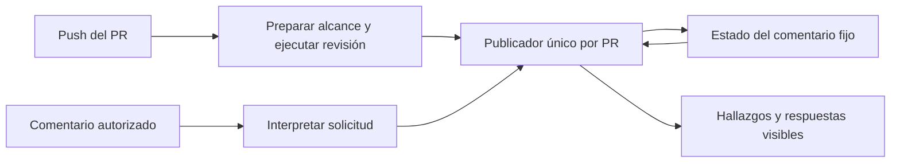

# Propuesta de mejoras del revisor

Estado: diseño para revisión humana. No implementado ni autorizado para ejecución.
Base examinada: `2b37230`, 27 de septiembre de 2026.

## Objetivo y alcance

Acercar el revisor a la utilidad de CodeRabbit en dos aspectos: encontrar defectos relevantes y permitir discutirlos dentro del PR. La prioridad propuesta es precisión, continuidad de la memoria y después velocidad e interacción. No hay todavía una comparación que demuestre equivalencia de calidad.

CodeRabbit documenta revisiones incrementales, conversación y contexto del repositorio. Sirven como referencia de capacidades, no como prueba de que su diagnóstico sea correcto. [Descripción oficial](https://docs.coderabbit.ai/guides/code-review-overview). También ofrece [instrucciones por rutas](https://docs.coderabbit.ai/configuration/path-instructions).

Ya están resueltos y quedan como base:

- PR #20: después de una revisión incompleta o desconocida, volver a revisión completa, conservando hallazgos, descartes y el delta real para resolver problemas.
- PR #22: reintentar de forma acotada el error concreto de `reasoning_content` de OpenCode Go.
- Memoria de hallazgos, IDs, descartes autorizados, detección de reversiones y filtrado incremental por archivos.

Esta propuesta no cambia el modelo, el proveedor ni la política de avisar ante fallas de infraestructura. Conserva un único comentario del bot. Los comentarios inline quedan como alternativa posterior, porque cambian ese contrato.

## Experiencia propuesta

Después de un push, el comentario diría qué cambió, qué problemas siguen abiertos, qué evidencia respalda cada problema y qué parte quedó pendiente. Cada resultado identifica el commit revisado.

Un hallazgo se vería así: “F3: este consumidor sigue usando el nombre anterior. El cambio renombra la función, pero esta llamada conserva el nombre viejo”. Incluiría enlaces al código de ese commit y, si existe, al check que reproduce el fallo. Una sospecha sin reproducción no se presentaría como un fallo demostrado.

El usuario podría escribir:

| Comando propuesto | Resultado esperado |
|---|---|
| `ai-review: explicar F3` | Explicación y evidencia de F3 en el comentario fijo. No modifica su estado. |
| `ai-review: descartar F3` | Descarte persistente sin necesitar otro push. |
| `ai-review: revisar` | Solicitud de revisión del commit actual. Varias solicitudes pendientes pueden agruparse en una revisión. |

“Sin otro push” significa que el comentario dispara trabajo. No promete respuesta instantánea si Actions o el proveedor no están disponibles. Todos estos comandos requieren permiso de escritura, mantenimiento o administración, incluso los que consumen llamadas al modelo.

## Mejoras y orden recomendado

| Bloque | Qué se diseñaría | Condición para considerarlo útil |
|---|---|---|
| 0. Medición | Comparador de revisiones sobre los mismos commits, con defectos adjudicados por una persona. | Distinguir mejoras de detección de simples cambios de estilo o cantidad de comentarios. |
| 1. Memoria segura | Estado versionado que no recorte identidades ni borre descartes para caber. | Migración y desborde sin pérdida silenciosa de estado. |
| 2. Identidad y evidencia | Separar el ID del título; guardar ubicación verificable, causa propuesta y evidencia. | Mantener F3 al mover o reformular el mismo problema, sin fusionar bugs distintos. |
| 3. Incremental real | Entregar principalmente el delta desde la última revisión completa, con contexto adicional separado. | Menor trabajo en el segundo push sin perder defectos conocidos ni resolver falsamente hallazgos. |
| 4. Contexto dirigido | Elegir consumidores, pruebas, reglas por carpeta y resultados de CI relevantes. | Encontrar defectos entre archivos que la versión actual omite, con costo aceptable. |
| 5. Conversación | Procesar explicar, descartar y revisar mediante eventos de comentarios. | Comandos autorizados, repetibles y compatibles con una revisión concurrente. |
| 6. Continuación selectiva | Recordar archivos pendientes de un mismo commit. | Sólo construirla si las recuperaciones completas siguen agotando el presupuesto con frecuencia. |
| 7. Comentarios inline | Colocar algunos hallazgos junto a líneas del diff. | Sólo si el comentario fijo dificulta actuar y se acepta cambiar la presentación. |

El seguimiento [#23](https://github.com/gon0801/goncloud-pr-review/issues/23) es un bloque pequeño independiente: agregar una prueba del recorrido completo de `cmd_run` para el error del proveedor. La normalización de otros mensajes se estudiaría cuando exista otra variante observada; no se amplía preventivamente el reintento.

## Arquitectura elegida

Mantener un estado compacto en el comentario, con un módulo que concentre sus reglas. Las ejecuciones del modelo producen resultados aislados; sólo el publicador modifica el estado persistente. Los comandos públicos de la action continúan siendo `gate`, `prepare`, `run` y `publish`.



Mapa propuesto, sin crear todavía estos módulos:

| Dueño | Responsabilidad |
|---|---|
| `review.py` existente | Adaptador CLI, Git/GitHub, proveedor y presentación. Conserva los comandos de la action. |
| `review_domain.py` futuro | IDs, transiciones, cobertura, comandos aceptados, lectura/migración y capacidad del estado. Sin red ni modelo. |
| `review_context.py` futuro | Selección del delta, relaciones y reglas aplicables. Se extrae al incorporar esa capacidad, no antes por organización estética. |
| Evaluador separado | Corpus, salidas congeladas, adjudicación y métricas. No es una dependencia del revisor de producción. |

La interfaz del dominio debe ocultar las reglas de fusión y memoria. No se crean módulos independientes para cargar, validar y guardar el mismo esquema. Esto aplica **Model the Domain** y **Minimize Reader Load**. Mantener GitHub como persistencia inicial aplica **Laziness Protocol**; no implica que 8 KB alcancen para siempre.

Usos conceptuales, antes de definir los datos:

```text
plan = domain.plan(estado_leido, hechos_del_repositorio, politica)
transicion = domain.accept(estado_actual, plan, informe_validado)
transicion = domain.command(estado_actual, comando_autorizado)
```

Boceto de contratos, exclusivamente descriptivo:

```text
Revision = {base_sha, head_sha, policy_digest}
Load = Valid(Snapshot) | Legacy(Snapshot) | Missing | Invalid(reason) | Future(version)
Snapshot = {schema: 2, generation, revision, next_id,
            completion, findings, command_cursor, pending_requests}
Completion = CompleteClaim | Partial | Unknown
Finding = {id, title, severity, status, primary_anchor,
           related_anchors, cause_hint, evidence}
Status = Open | Resolved(at_sha, evidence) | Dismissed(command_id)
Anchor = Legacy(path, line) | Located(path, blob_sha, range, excerpt_digest, symbol_hint)
Evidence = Source(anchor) | Check(check_id, head_sha, producer, conclusion, url)
         | UnverifiedClaim(text)
Plan = {revision, basis_generation, mode: Full | Delta(previous_sha),
        changed_paths, obligations, context_refs, exclusions}
Report = {observations, evidence, addressed_obligations, claimed_coverage}
Command = Dismiss(ids) | Explain(id) | RequestReview
AuthorizedCommand = {comment_id, actor, command, permission_observed}
Transition = Replace(Snapshot) | Keep(reason) | RequestWork(request)

plan(load, repository_facts, policy) -> Plan
accept(snapshot, plan, report) -> Transition
command(snapshot, authorized_command) -> Transition
```

`pending_requests` contiene solicitudes de explicar o revisar ya aceptadas pero aún no satisfechas. `RequestWork` sólo se despacha después de persistir su solicitud con ID estable. Una primera revisión construye un snapshot inicial vacío; un estado inválido nunca se transforma en ese estado vacío.

## 1. Memoria y migración

Hoy [serialize_findings](../review.py) puede acortar rutas y eliminar hallazgos para respetar el límite. Añadir más información sin resolverlo aumentaría la posibilidad de perder identidad o descartes. Además, el límite actual se calcula con `len` del texto, no con bytes UTF-8.

Primero se introduciría un lector compatible con ambos esquemas, manteniendo temporalmente la escritura antigua. Después se habilitaría v2, con un límite inicial explícito de 8000 bytes UTF-8 y un presupuesto para el comentario completo. Antes del cambio se detendrían escritores antiguos aún activos.

El estado legado válido conserva IDs, estados, contador y cursor. Sus ubicaciones se marcan como legado; no se inventan evidencias. Una versión desconocida o un bloque corrupto preserva el comentario original y produce un aviso. Una revisión completa puede examinar el código, pero no reconstruye descartes perdidos.

Se puede recortar explicación visible. No se recortan rutas, identidades, descartes, solicitudes aceptadas ni datos necesarios para interpretar un hallazgo. Si el estado no cabe, se conserva el último estado válido y no se avanza el SHA revisado ni se confirma una operación que no quedó guardada. El resultado nuevo queda como diagnóstico, sin sustituir la memoria.

Si el límite impide operar con la muestra real, habría que decidir entre ampliar el espacio o cambiar la persistencia antes de activar esas funciones. Los artefactos temporales sirven como evidencia de una ejecución, no como memoria obligatoria del PR. Borrar el comentario puede destruir memoria; no se promete recuperar lo que ya no existe en GitHub.

El retorno seguro desactiva las funciones nuevas pero conserva un lector/escritor compatible con v2. Volver al binario anterior a ese lector podría perder información y no sería un rollback válido.

## 2. Identidad, evidencia y resolución

El programa asigna IDs. El título es presentación y puede cambiar. La coincidencia considera ruta, correspondencia de renombre, contexto del fragmento y causa propuesta. La categoría o causa que inventa el modelo es una pista, no una identidad confiable.

Un renombre necesita correspondencia comprobable y un ancla compatible. Si dos problemas coinciden de forma ambigua, quedan separados con una indicación de posible duplicado. No se usa similitud semántica para descartar automáticamente un problema. Los descartes legados se conservan durante la transición.

Cada hallazgo debe distinguir qué afirma y qué evidencia lo respalda. Verificar archivo, blob, líneas y extracto demuestra que la cita existe en ese commit. No demuestra que el diagnóstico sea correcto. Las instrucciones de reproducción que propone el modelo no se ejecutan automáticamente.

Resolver exige un cambio pertinente y evidencia del arreglo. La ausencia de F3 en la respuesta no lo resuelve. Se conserva la resolución determinista por reversión exacta. Si el modelo evalúa que un arreglo es suficiente, se presenta como evaluación, no como prueba ejecutada.

## 3. Incremental real

Hoy se seleccionan archivos modificados desde el intento anterior, pero se entrega su diff completo contra la base. La propuesta separa la tarea principal, `previous_sha..head`, del contexto, `merge_base..head` y fragmentos actuales.

Sólo se permite delta cuando la revisión anterior tiene cobertura completa declarada y memoria válida. Rebase, cambio de base o política, y revisión anterior parcial requieren revisión completa. El delta real permanece separado del alcance para conservar el comportamiento de PR #20.

Las obligaciones comprenden cambios nuevos y hallazgos abiertos afectados, incluidos arreglos en consumidores o pruebas. Una eliminación usa contexto del commit anterior. Una reversión aparece en el delta aunque desaparezca del diff global del PR. Lo omitido por presupuesto queda explícito; no se convierte en cobertura completa.

Se compararía esta entrada con la actual antes de activarla. Un diff más corto puede ser más rápido y también ocultar contexto; no se presupone que sea mejor.

## 4. Contexto, reglas y CI

Seleccionar primero imports, consumidores directos y pruebas vinculadas. Cada relación indica si procede de búsqueda textual o análisis sintáctico. La ausencia de una coincidencia textual no demuestra que no exista un consumidor. Mantener Read/Grep/Glob para exploración adicional.

Definir un presupuesto de contexto y registrar las omisiones. No construir un índice completo del repositorio hasta que haya casos que justifiquen su costo. Las mediciones previas de [Plans.md](../Plans.md) no demostraron que agregar contexto precalculado redujera los turnos.

Las reglas por carpeta se leen desde una revisión base confiable y una lista de archivos autorizados. Se aplican de general a específica con precedencia documentada. Modificar esas reglas dentro del PR es contenido a revisar; no cambia las instrucciones de esa misma revisión.

La evidencia de CI incluye SHA exacto, productor, conclusión y enlace. Un check de otro commit no respalda el actual; uno verde no demuestra ausencia de bugs. Si faltan permisos de lectura de checks o Actions, se indica que esa evidencia no está disponible. Logs y artefactos se consideran datos no confiables y se limita su tamaño.

## 5. Conversación y concurrencia

Agregar un workflow para comentarios, con código confiable de la rama por defecto. Se verifica que sea un PR abierto del mismo repositorio y se conservan las exclusiones de drafts y forks. El job con credenciales no ejecuta código del PR.

Aceptar sólo comandos completos en comentarios nuevos. Editar un comentario antiguo no cambia una decisión ya procesada. Si falla la consulta de permisos, el comando queda pendiente. El ID del comentario es la clave para reconocer repeticiones.

Para `descartar todo`, conservar la semántica actual: capturar los hallazgos abiertos cuando se procesa, no los que se descubran después. La respuesta enumera lo descartado. La explicación primero reutiliza evidencia guardada; una ampliación del modelo queda ligada al SHA y no altera estados.

Separar el trabajo lento del modelo de una publicación breve y serializada por PR. Todos los escritores comparten el mismo grupo de publicación y no cancelan al escritor activo. La concurrencia de Actions no se trata como una cola durable ni ordenada. [Documentación de GitHub](https://docs.github.com/en/actions/how-tos/write-workflows/choose-when-workflows-run/control-workflow-concurrency).

Cada publicador relee el snapshot y los comentarios pendientes, procesa un prefijo confirmado y guarda cursor y efecto juntos. Si una ejecución pendiente es reemplazada, la siguiente vuelve a descubrir solicitudes no atendidas. Un evento perdido antes de cualquier ejecución puede requerir repetir la solicitud; no se promete entrega garantizada sin una cola durable.

Un comando no autorizado o con ID inexistente recibe un resultado de rechazo y puede avanzar el cursor cuando ese resultado queda persistido. Si falla la consulta de permisos o no cabe el nuevo estado, el cursor no cruza ese comando. Un comando posterior no sirve para marcar como atendido uno anterior que quedó sin confirmar.

Las solicitudes largas quedan pendientes antes de iniciar el modelo y se identifican por comentario y SHA. Fallar después del PATCH no duplica un efecto al repetir el evento. No se espera al modelo dentro del bloqueo para aplicar un descarte. Los resultados usan archivos separados por ejecución.

Si el publicador no puede recuperar el resultado de una ejecución, deja la solicitud pendiente y registra un fallo recuperable. La ausencia del archivo no equivale a una revisión vacía o completa. Otra ejecución o una solicitud repetida puede retomarla.

Antes de publicar se vuelven a consultar head, base, política y generación. Si sólo cambiaron descartes, se fusiona conservadoramente contra el estado más reciente. Si cambió la base del análisis, se descarta el resultado para efectos de cobertura y se replanifica. Nunca se sobrescribe un descarte con la opinión anterior del modelo.

No existe aquí una transacción entre consultar HEAD y hacer PATCH. Puede llegar un push entre ambos. Por eso el comentario identifica siempre el SHA revisado y la siguiente ejecución reconcilia el desfase. La propuesta evita presentar el resultado como una aprobación sin versión; no promete atomicidad con los pushes.

## 6 y 7. Extensiones condicionadas

La continuación por archivo se consideraría si al menos 3 de 20 recuperaciones completas recientes vuelven a agotar presupuesto. Es un umbral propuesto, no medido. Guardaría pendientes vinculados a head, base y política; un cambio invalida ese lote. Un máximo inicial de dos continuaciones evita un ciclo ilimitado. La declaración de cobertura del modelo no prueba exhaustividad.

Los comentarios inline se considerarían cuando al menos cinco casos evaluados muestren dificultad para localizar la acción desde el comentario fijo. También es un criterio propuesto. Requerirían IDs de comentarios, SHA, ubicación válida en el diff y deduplicación. Los hallazgos sin una línea válida permanecerían en el resumen. Esta extensión necesita aceptar expresamente más de un comentario del bot.

## Medición y aceptación

Diseñar un corpus inicial de 30 PRs de los repositorios usuarios, incluyendo al menos 10 pares de pushes, casos sin defectos, reversiones, renombres, revisiones incompletas y cambios entre módulos. Separar casos de ajuste y un conjunto reservado. Congelar commit, base, configuración, versión y salida de cada revisor.

Comparar sólo salidas del mismo SHA. Si CodeRabbit no está disponible o está limitado, ese par queda sin medir; no se reemplaza por otro commit. Sus hallazgos no son la verdad de referencia. Un mantenedor evalúa sin identificar el producto y adjudica defectos accionables; otra revisión resuelve desacuerdos. Los bugs sembrados sirven para pruebas de regresión, no sustituyen la muestra real.

Medir hallazgos válidos, falsos positivos, duplicados, defectos conocidos omitidos, falsos resueltos, cobertura declarada, fallas por intento, turnos, tiempo y costo. La tasa de detección sobre defectos adjudicados no equivale a conocer todos los defectos del repositorio.

Propuesta para aceptar incremental y contexto: cero falsos resueltos en los casos de control, cero pérdidas nuevas de defectos High/Critical conocidos y precisión al menos igual al control en la muestra reservada. Para justificar el incremental, buscar además una reducción de al menos 20% de la mediana del segundo push. Publicar los conteos y la incertidumbre; treinta PRs no prueban equivalencia general.

Pruebas de aceptación de la arquitectura:

- Memoria legada, Unicode, corrupción, versión futura y desborde conservan IDs y descartes o bloquean la escritura con aviso explícito.
- Cambios de título, líneas y renombres comprobados conservan identidad; dos bugs distintos no se fusionan.
- Un arreglo en otro archivo puede resolver el hallazgo, pero un archivo sin cambios pertinentes no se resuelve sólo porque el modelo lo diga.
- Delta con eliminación, reversión, rebase y corte anterior mantiene todas las obligaciones pertinentes.
- Comando duplicado, permiso revocado, falla de permisos, crash antes/después del PATCH y push concurrente no pierden decisiones confirmadas.
- La explicación nunca resuelve ni descarta, y una cita válida no se presenta como prueba de un fallo ejecutado.
- `descartar F3` actualiza el comentario sin otro push y permanece descartado cuando termina una revisión iniciada antes del comando. Repetirlo no crea otra transición.
- `explicar F3` responde para el SHA del hallazgo sin cambiar su estado; un ID inexistente recibe rechazo explícito y una falla del modelo conserva la solicitud pendiente.
- `revisar` agrupa solicitudes compatibles para el mismo HEAD y no da por atendida una solicitud sólo por haberla despachado.

## Entrega futura y reversión

El orden sería medición y seguimiento #23; memoria compatible; identidad/evidencia; experimentos separados de delta y contexto; conversación. La continuación y los comentarios inline no son prerrequisitos. Las reglas por carpeta pueden probarse de forma independiente después de definir su frontera de confianza.

Cada bloque tendría activación independiente, pruebas focalizadas y un PR propio. La batería completa se ejecutaría una vez sobre su SHA final en CI, sin saltar candados. Las mediciones vivas respetarían la revisión cruzada requerida por las reglas del repo.

Los consumidores actuales usan `@main`: un merge afecta a los tres. El piloto debe ejecutarse primero contra una revisión candidata fija en el repo central; no se usa un merge como experimento inicial. Desactivar una optimización devuelve la entrada anterior sin perder la memoria nueva. Desactivar comentarios deja sus decisiones ya persistidas.

## Alternativas y síntesis

Se compararon dos propuestas independientes: A, snapshot con reglas de dominio; B, registros de revisión y comandos reducidos a un checkpoint. Ambas identificaron que llamar “registro” a un archivo temporal no aporta durabilidad.

Se propone A como base por su interfaz pequeña y compatibilidad con la instalación actual. De B se incorporan resultados inmutables por ejecución, solicitudes pendientes persistidas y procedencia de las decisiones. No se adopta un historial ilimitado ni se guarda todo el razonamiento del modelo.

La evaluación independiente coincidió con esta elección: A obtuvo 9/10 y B 8/10 en preservación de contratos, aceptación, concurrencia/persistencia, claridad de responsabilidades y medición. Son valoraciones de diseño, no resultados de rendimiento. Sus observaciones sobre cursor, desborde, resultados inaccesibles y carrera con HEAD están incorporadas arriba.

Un servicio con base de datos y cola durable permitiría auditoría y recuperación más fuertes, pero introduce operación, credenciales, retención y sincronización con GitHub. Se reconsideraría si la memoria compacta no alcanza o si recuperar un comentario eliminado se convierte en requisito. No es necesario para comenzar a medir ni para mejorar el delta.

Quedan tres datos por obtener antes de fijar compromisos: capacidad real del estado enriquecido, disponibilidad de pares comparables con CodeRabbit y latencia aceptable de comandos. El primer trabajo futuro sería definir el corpus y los casos de memoria, no implementar todos los bloques a la vez.

Fuentes examinadas: código y pruebas locales, historial de PR #20/#22, `Plans.md`, issue #23 y documentación oficial citada. No se consultaron analítica de producto ni conversaciones de equipo; no se atribuyen decisiones a datos que no están disponibles.
